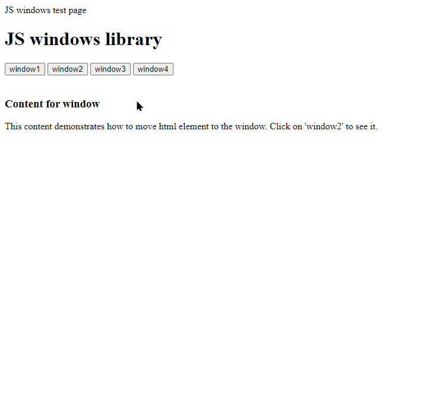

# jswin
Window library for javascript

Usage:
Install
Just include jswin.js and jswin.css to your project

Usage
Create instance of JSWIN library:
var jswin = new JSWIN()

Windows can be created in different ways:
1. Passing html code to function:
jswin.createWindow('
my html code
', 'my title', parameters)
2. Passing element or element's ID to createWindow:
var elem = document.querySelector('#myid')
jswin.createWindow(elem, 'My title', parameters)
3. Passing http link to web page you would like to load to the window:
jswin.createWindow('https://wikipedia.org', 'my title', parameters)

Parameters
Paraeters is an object which contains all additional data to created window:\
{\
&nbsp;&nbsp;&nbsp;&nbsp;pos: `<position expression>`,\
&nbsp;&nbsp;&nbsp;&nbsp;size: `<size expression>`,\
&nbsp;&nbsp;&nbsp;&nbsp;trans: transition time (milliseconds)\
}\ \

where\
`<positon expression>` could be one of following:\
&nbsp;&nbsp;&nbsp;&nbsp;[x, y] - left and top corner of window, array\
&nbsp;&nbsp;&nbsp;&nbsp;'center' - position at center of window\ \

`<size expression>` could be one of following:\
&nbsp;&nbsp;&nbsp;&nbsp;[width, height] - array of sizes\
&nbsp;&nbsp;&nbsp;&nbsp;{scale, ratio} - object with 'scale' and 'ratio' fields. \
&nbsp;&nbsp;&nbsp;&nbsp;&nbsp;&nbsp;scale relative to browser window \
&nbsp;&nbsp;&nbsp;&nbsp;&nbsp;&nbsp;ratio = width / height of window to create\
\
DEMO:\
http://jsfiddle.net/iasm/6mjq5ak8/3/
